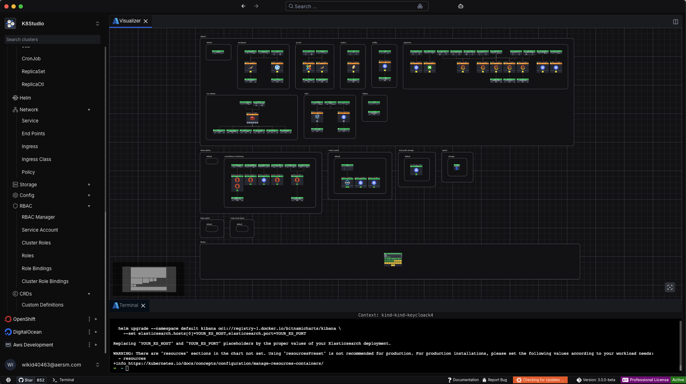

# K8Studio

## About
**K8Studio V3** is the most powerful and intuitive version yet. This cross-platform Kubernetes IDE has been redesigned from the ground up for speed, flexibility, and real-time collaboration. Whether you manage clusters on **EKS, GKE, AKS, IBM Cloud**, or **bare metal**, K8Studio V3 helps you visualize, control, and optimize your infrastructure with unmatched precision.

Now featuring a **multi-window interface**, advanced logging, AI assistance, and a brand-new **K8Studio Visualizer**, V3 is the ultimate toolbox for Kubernetes professionals.

For more info visit our website [k8studio](https://k8studio.io)
To watch a demo take a look at [our youtube channel](https://youtu.be/BvAemIubm-o) that shows how to use the component.

## Join K8Studio Community
You can join our 
[Slack Channel](https://join.slack.com/t/k8studio/shared_invite/enQtNjgxMDU1NzkzMDc0LWM0ZTc3MjU5ZGIzN2MxMDhkOGFjOGNjYmU1YzI3YzRmMjUzNmU5ZjMxZTVlODMwZDY3ODY1NjhlM2NhYjVlODQ) for more information or to contact our team

## ✨ What’s New in V3

### 🧭 Multicluster Workspace with Multi-Window Support
With K8Studio V3, you can now open and manage **multiple clusters simultaneously**. Thanks to the new **Multi-Window Docking Layout Manager**, you can open as many tabs as needed—across any cluster—and fully customize your workspace. Arrange views side by side, or stack them in tabs to **monitor and work with multiple clusters in parallel**, all within a single, unified interface.

### 🗂️ Customizable Docking Layout
Our powerful Docking Layout Manager gives you full control over your workspace. Open multiple windows, drag and drop views, and organize panels to match your workflow. Build the perfect multi-cluster dashboard with ease.

### 🤖 AI Copilot – Context-Aware Kubernetes Assistant
K8Studio V3 now includes an integrated **AI Copilot**, designed to assist you intelligently based on your current selection and workspace context. Whether you're editing YAML, reviewing logs, or troubleshooting a deployment, Copilot gathers relevant data—like object definitions, logs, and configuration files—to provide targeted help.

Ask questions, generate YAML, resolve errors, or get best-practice guidance—all powered by a Kubernetes-aware AI assistant that works inside the application.

### 📊 Overview Panel
The all-new **Cluster Overview Page** gives you a real-time summary of key metrics like **CPU**, **memory**, and **pod usage**. View resource requests, limits, and actual consumption at a glance to monitor cluster health and performance.

### 🔐 Permissions View
Quickly view all **roles and permissions** assigned to your user within a cluster. Gain visibility into what you can access, troubleshoot permission issues, and collaborate securely.

### 📄 Advanced Logs
The new **Advanced Logs** feature allows you to view logs across **Deployments or multi-container Pods** in a consolidated, structured format. Easily switch between containers or view logs from all replicas. Logs are color-coded and auto-streamed for better debugging and clarity.

---

## 🔧 Enhanced Core Features

### 🌐 K8Studio Visualizer (Previously Deployment View)
The upgraded **Visualizer** delivers an interactive, real-time map of your deployments, services, pods, and network relationships. Edit configurations directly from the UI. View rollouts, status changes, versions, and rollbacks—no CLI required.

### 🧮 Grid View
Explore your infrastructure with a data-first interface. Grid View provides detailed insights for performance tuning, auditing, and operational decision-making.

### ✏️ Quick Editor
Update objects faster with the **Quick Editor**, a smart, schema-aware interface that validates YAML, offers suggestions, and explains configuration fields. Includes built-in helpers for:
- **Docker Images**
- **Labels**
- **Volumes**
- **RBAC Roles**
- **Secrets**
- **ConfigMaps**

### 📝 YAML Editor
For advanced users, the **YAML Editor** features syntax highlighting, keyword auto-completion, and live validation. Any change you make is reflected across the interface and synced with the cluster.

### ⚙️ Configuration Manager
Manage **ConfigMaps** and **Secrets** from a unified interface. Easily create, edit, and delete key-value pairs. Built-in **Base64 encoding/decoding** makes working with secrets seamless.

### 🔐 RBAC Manager
Take control of access with the RBAC Manager. Create and manage **users, groups, roles**, and **service accounts** with a visual, intuitive interface.

### ⛵ Helm Manager
Simplify Helm chart and release management. Install, monitor, and update Helm charts with a clear, structured UI.

### 🔍 Filter and Search
Quickly locate any object using the global search bar. Search by name, label, or image, and use advanced filters to limit by namespace or object type.

### 💻 SSH & Logs
Directly access logs or SSH into pods and nodes with a built-in terminal. No need for external tools or remembering IPs and commands.

---

## 💬 Join the K8Studio Community
Need help or want to connect? Join our [Slack Channel](#) to chat with the team and other Kubernetes professionals.

## 🎥 See K8Studio V3 in Action  
Check out our [YouTube Channel](#) for demos, walkthroughs, and tutorials on all the latest features.

👉 Visit [k8studio.io](#) to get started with V3 today!

